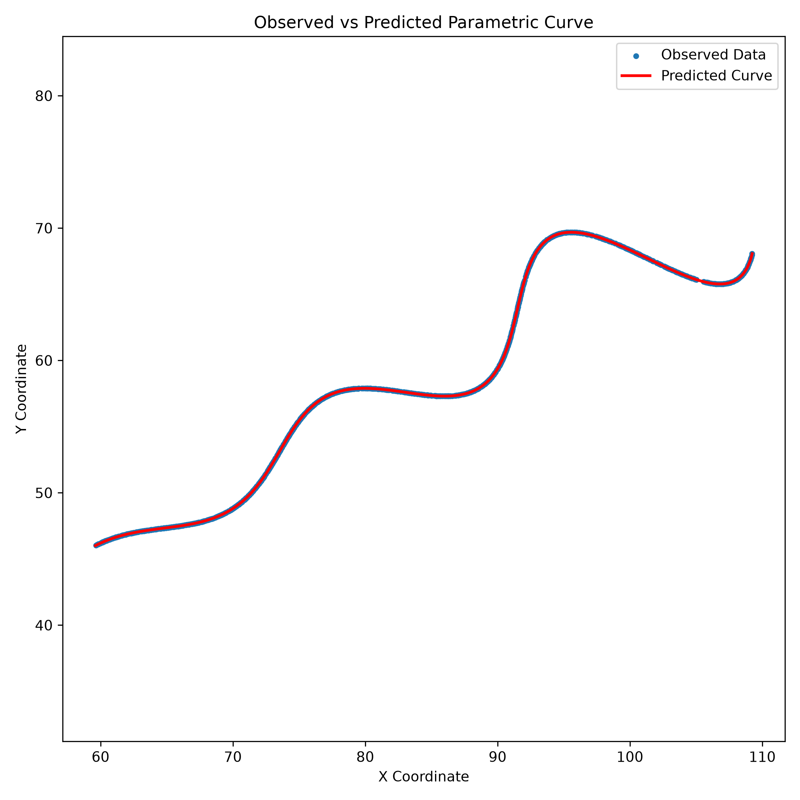

# AI R&D Assignment

# Parameter Estimation of a Nonlinear Parametric Curve using Differential Evolution

---

## Table of Contents

1. Project Overview
2. Problem Statement
3. Mathematical Model
4. Understanding the Unknown Parameters
5. Methodology
6. Mathematical Formulation
7. Loss Function
8. Optimization Strategy
9. Implementation Details
10. Experimental Results
11. Discussion
12. Conclusion
13. Project Structure
14. Installation and Execution
15. References

---

# 1. Project Overview

This project focuses on estimating the unknown parameters of a nonlinear parametric curve from a set of observed two-dimensional points. The mathematical equation describing the curve is known; however, three important parameters are intentionally hidden. The objective is to recover these unknown parameters by minimizing the difference between the observed curve and the predicted curve generated by the mathematical model.

Unlike conventional curve fitting problems, the dataset only contains Cartesian coordinates without the corresponding parameter values used to generate those coordinates. Consequently, the problem cannot be solved using direct substitution and must instead be formulated as a numerical optimization problem.

To solve this problem, the mathematical model was implemented in Python and an optimization pipeline was developed to estimate the unknown parameters. The predicted curve was generated repeatedly using different parameter values, and the quality of each prediction was evaluated using the total L1 distance between the observed points and the generated curve. Differential Evolution was selected as the optimization algorithm because it performs a global search without requiring gradient information and is well suited for nonlinear optimization problems.

The entire workflow, including data loading, curve generation, optimization, visualization, and result generation, has been implemented using Python together with NumPy, SciPy, Pandas, and Matplotlib.

---

# 2. Problem Statement

The assignment provides a dataset containing 1500 two-dimensional points sampled from an unknown parametric curve. The mathematical equation of the curve is known, but three parameters are hidden.

The objective is to estimate the following unknown variables:

- θ (Rotation Angle)
- M (Exponential Growth Parameter)
- X (Horizontal Translation)

The valid search ranges are

| Parameter | Range |
|------------|----------------|
| θ | 0° – 50° |
| M | -0.05 – 0.05 |
| X | 0 – 100 |
| t | 6 – 60 |

The provided dataset contains only Cartesian coordinates.

```
(x1,y1)
(x2,y2)
...
(x1500,y1500)
```

The original parameter values used to generate these points are not provided.

Therefore, the objective is to estimate the unknown parameters that minimize the difference between the observed dataset and the curve generated by the mathematical model.

---

# 3. Mathematical Model

The curve is defined by the following parametric equations.

$$
x(t)=t\cos(\theta)-e^{M|t|}\sin(0.3t)\sin(\theta)+X
$$

$$
y(t)=42+t\sin(\theta)+e^{M|t|}\sin(0.3t)\cos(\theta)
$$

These equations consist of three important components.

---

## 3.1 Linear Component

$$
t\cos(\theta)
$$

$$
t\sin(\theta)
$$

These two terms determine the overall direction of the curve.

Changing the value of θ changes the direction in which the curve grows.

---

## 3.2 Oscillation Component

$$
e^{M|t|}
\sin(0.3t)
$$

This component introduces periodic oscillations into the curve.

Unlike a standard sine wave, the oscillation amplitude is multiplied by an exponential term.

If

$$
M>0
$$

the oscillation amplitude gradually increases.

If

$$
M<0
$$

the oscillation amplitude gradually decreases.

When

$$
M=0
$$

the exponential term becomes one and the oscillation amplitude remains constant.

---

## 3.3 Translation Component

The parameter

$$
X
$$

shifts the entire curve along the horizontal axis.

Similarly,

$$
42
$$

represents a constant vertical translation.

Neither of these values changes the overall shape of the curve.

---

# 4. Understanding the Unknown Parameters

Understanding the influence of each parameter is important before attempting optimization.

### θ (Rotation Angle)

The angle θ determines the orientation of the entire curve.

Increasing θ changes the contribution of

$$
\cos(\theta)
$$

and

$$
\sin(\theta)
$$

which rotates the overall trajectory.

---

### M (Exponential Growth)

The parameter M controls the exponential scaling factor

$$
e^{M|t|}
$$

This directly affects the oscillation amplitude.

Positive values produce increasing oscillations while negative values produce decreasing oscillations.

---

### X (Horizontal Translation)

The parameter X shifts every point of the curve equally along the x-axis.

Unlike θ and M, it does not alter the curve shape.

Instead, it changes only the curve position.

---

# Why Numerical Optimization Is Required

If the values of θ, M and X were known, the curve could be generated directly by substituting different values of t into the mathematical equations.

However, in this assignment the situation is reversed.

The observed coordinates are available while the parameters that generated those coordinates are unknown.

Consequently, the problem becomes an inverse parameter estimation problem.

Instead of computing coordinates from parameters, the objective is to estimate the parameters from the observed coordinates.

Mathematically, the optimization objective can be expressed as

$$
(\theta,M,X)
=
\arg\min L(\theta,M,X)
$$

where

$$
L
$$

represents the total fitting error between the observed dataset and the predicted curve.

This transformation converts the assignment from a direct mathematical evaluation into a numerical optimization problem.

# 5. Methodology

The parameter estimation process was implemented as a numerical optimization pipeline. Since only the Cartesian coordinates of the curve were provided, the unknown parameters could not be determined directly. Instead, the problem was solved by repeatedly generating candidate curves, measuring how closely they matched the observed dataset, and updating the parameters until the total error was minimized.

The overall workflow used in this project is illustrated below.

```
                   Observed Dataset
                          │
                          ▼
                  Load CSV File
                          │
                          ▼
              Generate Parametric Curve
                          │
                          ▼
          Uniformly Sample Parameter t
                          │
                          ▼
          Compute Total L1 Distance
                          │
                          ▼
        Differential Evolution Optimizer
                          │
                          ▼
         Estimated Parameters (θ, M, X)
                          │
                          ▼
          Generate Final Plot & Results
```

The optimization algorithm repeatedly evaluates candidate parameter values until the predicted curve closely matches the observed dataset.

---

# 6. Mathematical Formulation

## 6.1 Forward Model

If the unknown parameters are available, the parametric equations can be evaluated directly to generate the corresponding curve.

Mathematically,

$$
(\theta,M,X)
\rightarrow
(x(t),y(t))
$$

This is known as the **forward problem**, where the parameters are known and the coordinates are computed.

---

## 6.2 Inverse Problem

The assignment provides the opposite situation.

Instead of knowing the parameters, only the generated coordinates are available.

Therefore, the objective becomes

$$
(x,y)
\rightarrow
(\theta,M,X)
$$

This is known as an **inverse parameter estimation problem**, where the unknown model parameters are recovered from observed measurements.

Because no closed-form analytical solution exists for this nonlinear model, numerical optimization is required.

---

## 6.3 Uniform Sampling of the Parameter

The assignment specifies that the parameter

$$
t
$$

lies within the interval

$$
6 \le t \le 60
$$

However, the individual values of

$$
t
$$

used to generate each observed point are not provided.

To approximate the continuous curve, the interval was uniformly sampled using

$$
N=1000
$$

points during optimization.

Mathematically,

$$
t_i
=
6
+
i
\left(
\frac{60-6}{N-1}
\right)
$$

where

$$
i=0,1,\ldots,N-1
$$

In Python, this sampling was implemented using

```python
t_samples = np.linspace(6, 60, 1000)
```

Uniform sampling provides a dense approximation of the continuous parametric curve and aligns with the assignment requirement of comparing uniformly sampled points.

A higher sampling resolution (3000 points) was used for the final visualization to obtain a smoother predicted curve.

---

# 7. Loss Function

## 7.1 Why Direct Point-to-Point Comparison Cannot Be Used

An intuitive approach would be to compare

$$
(x_i,y_i)
$$

from the dataset with

$$
(\hat{x}_i,\hat{y}_i)
$$

generated by the mathematical model.

However, this comparison is not valid because the original parameter value

$$
t
$$

corresponding to each observed point is unknown.

Therefore,

$$
(x_i,y_i)
$$

and

$$
(\hat{x}_i,\hat{y}_i)
$$

do not necessarily represent the same location on the curve.

A direct index-wise comparison would therefore produce incorrect error measurements.

---

## 7.2 Nearest-Point Matching

To overcome this limitation, every observed point is matched to its nearest point on the generated curve.

Let

$$
P=(x_r,y_r)
$$

represent one observed point.

Suppose the generated curve contains

$$
Q_1,Q_2,\ldots,Q_N
$$

where

$$
Q_i=(x_i,y_i)
$$

The L1 distance between the observed point and every generated point is computed as

$$
d_i
=
|x_r-x_i|
+
|y_r-y_i|
$$

The nearest generated point is selected by

$$
d(P,C)
=
\min_i d_i
$$

This procedure is repeated for every observed point in the dataset.

---

## 7.3 Total Loss

If the dataset contains

$$
N
$$

observed points, the total loss becomes

$$
L(\theta,M,X)
=
\sum_{k=1}^{N}
\min_i
\left(
|x_k-x_i|
+
|y_k-y_i|
\right)
$$

This objective function represents the total L1 distance between the observed dataset and the predicted curve.

A lower loss indicates a closer agreement between the generated curve and the observed points.

The optimization process aims to minimize this value.

---

# 8. Optimization Strategy

The optimization objective can therefore be expressed as

$$
\min_{\theta,M,X}
L(\theta,M,X)
$$

subject to the parameter bounds

$$
0^\circ < \theta < 50^\circ
$$

$$
-0.05 < M < 0.05
$$

$$
0 < X < 100
$$

The resulting optimization problem is nonlinear because the objective function contains

- Trigonometric functions
- Exponential functions
- Absolute value operations
- Nearest-point matching

These characteristics make gradient-based optimization difficult because the objective function is not smoothly differentiable everywhere.

For this reason, the Differential Evolution algorithm was selected.

Differential Evolution is a population-based global optimization algorithm that searches multiple candidate solutions simultaneously. Unlike gradient-based methods, it does not require derivative information and is capable of handling nonlinear objective functions with bounded search spaces.

In this implementation, the optimizer repeatedly generated candidate values of

- θ
- M
- X

computed the corresponding curve, evaluated the total L1 loss, and retained the parameter combinations that produced lower errors.

The optimization process terminated when further improvements became negligible.

---

# 9. Implementation Details

The complete solution was implemented using Python.

The project performs the following sequence of operations.

1. Read the observed dataset from `xy_data.csv`.
2. Generate the mathematical curve using candidate parameter values.
3. Uniformly sample the parameter interval.
4. Compute the total L1 distance between observed and predicted curves.
5. Estimate the unknown parameters using Differential Evolution.
6. Generate a visualization comparing the observed data with the fitted curve.
7. Save the estimated parameters and the final loss value.

The implementation follows a modular workflow where each stage performs a single well-defined task, making the code easier to understand, maintain, and reproduce.


# 10. Experimental Results

After implementing the optimization pipeline, the Differential Evolution algorithm converged to the following parameter estimates.

| Parameter | Estimated Value |
|-----------|----------------:|
| θ | 30.000365° |
| M | 0.030000 |
| X | 55.000588 |

Final L1 Loss

```
29.080674
```

The estimated parameters closely reproduce the observed dataset. A low L1 loss indicates that the generated curve closely matches the original curve from which the dataset was sampled.

The comparison between the observed data and the predicted curve is shown below.

```markdown

```

The visual overlap between the observed points and the predicted curve confirms that the optimization process successfully recovered the hidden parameters.

---

# 11. Discussion

Several design decisions were made during the implementation of this project.

### Uniform Sampling

The original values of the parameter **t** were not available in the dataset. Therefore, the interval

$$
6 \le t \le 60
$$

was uniformly sampled to approximate the continuous curve.

A sampling density of **1000 points** was selected during optimization because it provided a good balance between computational cost and estimation accuracy.

For the final visualization, the sampling density was increased to **3000 points**, producing a smoother predicted curve without significantly increasing the overall execution time.

---

### Choice of Distance Metric

The assignment explicitly specifies the use of the **L1 distance**.

Therefore, the error between the observed dataset and the generated curve was computed as

$$
|x_{real}-x_{pred}|+|y_{real}-y_{pred}|
$$

instead of the Euclidean (L2) distance.

Using the required distance metric ensures that the optimization objective matches the evaluation criterion described in the assignment.

---

### Choice of Optimization Algorithm

The mathematical model contains nonlinear trigonometric and exponential terms together with nearest-point matching.

Because of these characteristics, the objective function is not easily optimized using gradient-based methods.

Differential Evolution was therefore selected because it performs a global search, does not require derivatives, and works effectively for nonlinear optimization problems with bounded parameter ranges.

---

### Computational Considerations

The optimization routine evaluates the loss function many times.

Each loss evaluation compares every observed point with a densely sampled predicted curve.

Although this approach is computationally more expensive than direct point-to-point comparison, it provides a robust solution because the original parameter values corresponding to the observed points are unknown.

---

# 12. Conclusion

This project demonstrates a complete workflow for estimating the unknown parameters of a nonlinear parametric curve from observed data.

The mathematical model was implemented directly from the given equations, and the parameter estimation problem was formulated as a numerical optimization task.

A Differential Evolution optimizer was used to estimate the unknown variables by minimizing the total L1 distance between the observed dataset and the predicted curve.

The estimated parameters closely reproduced the original curve, resulting in a low fitting error and an accurate visual overlap between the observed points and the generated curve.

This project combines concepts from numerical optimization, scientific computing, mathematical modelling, and data visualization, providing a practical example of solving an inverse parameter estimation problem.

---

# 13. Project Structure

```
AI-RD-Assignment/
│
├── data/
│   └── xy_data.csv
│
├── results/
│   ├── plot.png
│   └── result.txt
│
├── estimate.py
├── README.md
├── requirements.txt
├── LICENSE
└── .gitignore
```

---

# 14. Installation and Execution

## Clone the Repository

```bash
git clone <repository-url>
cd AI-RD-Assignment
```

---

## Create a Virtual Environment (Optional)

Windows

```bash
python -m venv .venv
.venv\Scripts\activate
```

Linux / macOS

```bash
python3 -m venv .venv
source .venv/bin/activate
```

---

## Install Dependencies

```bash
pip install -r requirements.txt
```

---

## Run the Project

```bash
python estimate.py
```

---

## Generated Output

Running the script automatically produces

```
results/
│
├── plot.png
└── result.txt
```

The terminal also prints the estimated parameter values and the final L1 loss.

---

# 15. Future Improvements

Although the current implementation achieves an accurate parameter estimate, several improvements could be explored in future work.

- Use a KD-Tree or spatial indexing structure to accelerate nearest-neighbour searches for larger datasets.
- Investigate alternative global optimization algorithms such as Particle Swarm Optimization or Bayesian Optimization.
- Estimate the parameter **t** for each observed point jointly with the model parameters.
- Extend the approach to fit more complex parametric or three-dimensional curves.

---

# References

Storn, R., & Price, K. (1997). *Differential Evolution – A Simple and Efficient Heuristic for Global Optimization over Continuous Spaces*. Journal of Global Optimization, 11(4), 341–359.

Virtanen, P., et al. (2020). *SciPy 1.0: Fundamental Algorithms for Scientific Computing in Python*. Nature Methods, 17, 261–272.

Harris, C. R., et al. (2020). *Array Programming with NumPy*. Nature, 585, 357–362.

Hunter, J. D. (2007). *Matplotlib: A 2D Graphics Environment*. Computing in Science & Engineering.

---

## Acknowledgement

The implementation, experiments, mathematical explanations, and documentation in this repository were developed as part of the AI R&D assignment based on the problem statement provided. Standard scientific Python libraries and the original Differential Evolution algorithm were used to implement the solution.